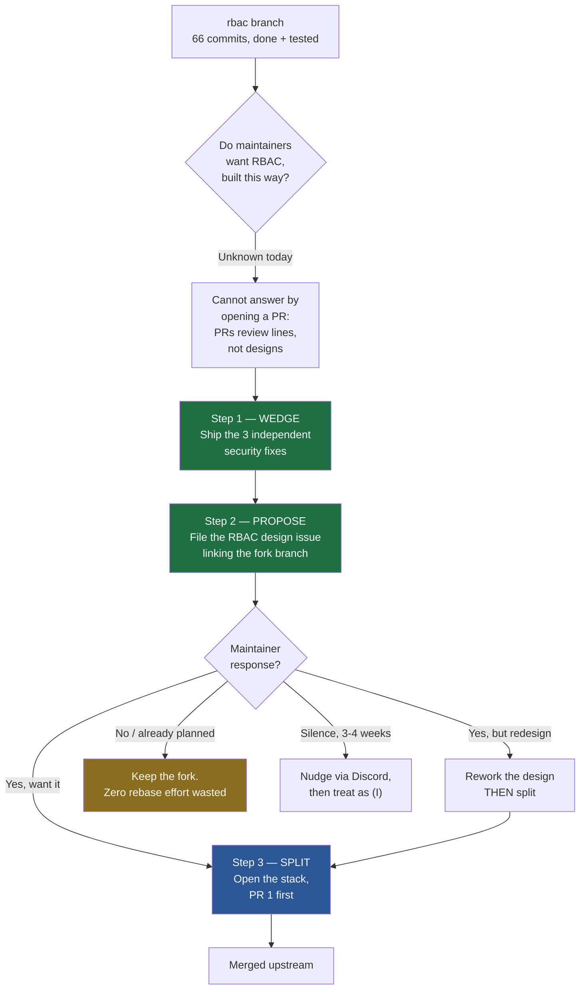
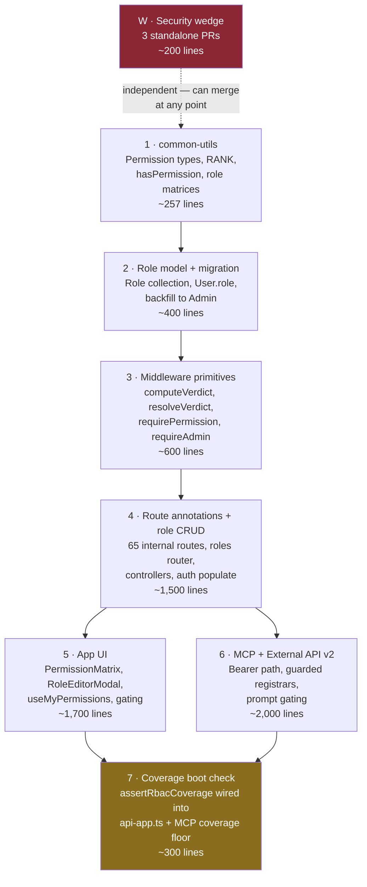
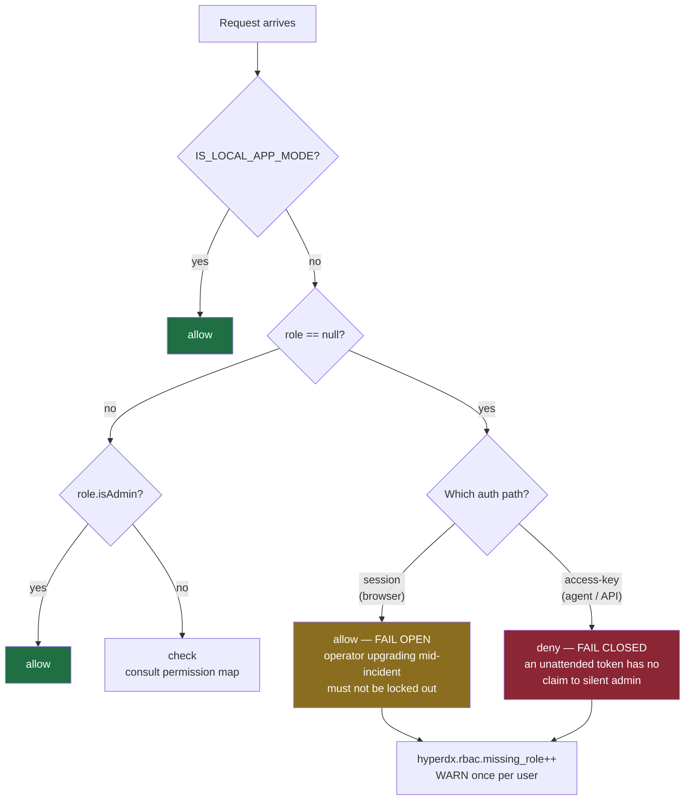
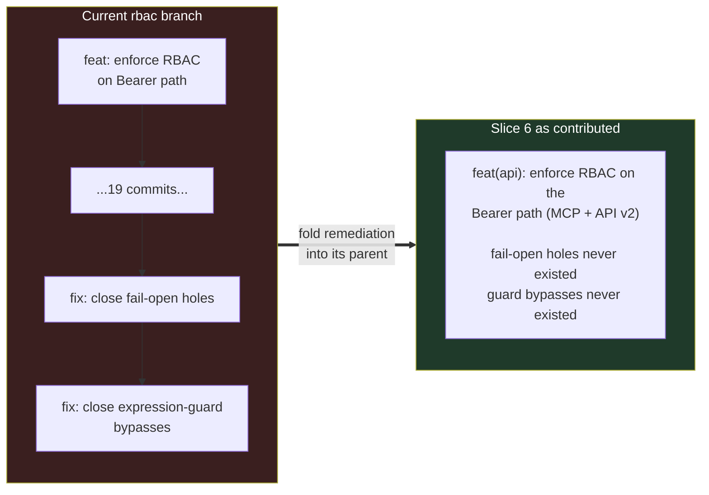

# Upstreaming RBAC to hyperdxio/hyperdx — Contribution Plan

- **Date:** 2026-08-06
- **Status:** Draft — awaiting maintainer contact
- **Source branch:** `rbac` (66 commits, 153 files, +17,367/−921 vs `main`)
- **Companion:** [`2026-08-06-upstream-rbac-proposal.md`](./2026-08-06-upstream-rbac-proposal.md) — the issue to file

---

## 1. The problem this plan solves

The `rbac` branch is finished and tested, but it cannot be contributed as it stands:

| | files | insertions |
|---|---|---|
| `docs/superpowers/*` (planning artifacts) | 6 | 9,158 |
| `.changeset/` | 3 | 92 |
| api — tests | ~40 | ~3,400 |
| api — src + migrations | ~76 | ~2,760 |
| app | 24 | 1,708 |
| common-utils | 3 | 257 |

Three separate problems are tangled together, and each needs a different fix:

1. **53% of the diff is planning artifacts.** The specs, plans, and mockups under
   `docs/superpowers/` never go upstream. They become the proposal issue and the PR
   descriptions instead.
2. **The history reviews every bug twice.** `feat(api): enforce RBAC on the Bearer path`
   is followed, twenty commits later, by `fix(rbac): close fail-open holes found in code
   review` and `fix(api): close the demonstrated expression-guard bypasses`. Those are
   fixes to code that is not upstream yet. Preserving them makes a reviewer read the
   broken version first. Remediation must be folded into the commit that introduced the
   code.
3. **No maintainer has agreed to any of this.** No issue, no discussion, no Discord
   thread. A perfect split of an unwanted design is a perfect rejection.

Problem 3 is the binding constraint. Problems 1 and 2 are mechanical.

---

## 2. Sequencing decision: validate before splitting



**Why the wedge comes first.** The three security fixes in §3 need no design buy-in
whatsoever — they are defects in code upstream already ships. Merging them makes the
author a known contributor before the large proposal lands, and gives the proposal a
natural opening: *"I found these while building an authorization model — here is the
model."*

**Why splitting comes last.** Splitting costs 1–2 days of careful rebase. Maintainers
frequently redraw slice boundaries to match their own review preferences. Doing the split
before asking risks paying that cost twice.

---

## 3. The wedge: three independent security fixes

Each of these is a defect in code that exists on `main` today. None depends on RBAC. Each
ships as its own small PR.

### 3.1 Cross-tenant invitation delete

`packages/api/src/routers/api/team.ts:232` on `main`:

```js
await TeamInvite.findByIdAndDelete(id);
```

Deletes by `_id` with no team scoping. Any authenticated user of any team can delete any
other team's pending invitations. Fix is ~6 lines plus a test.

### 3.2 Expression guard bypass on `/api/v2`

`packages/api/src/routers/external-api/v2/search.ts:156` on `main` rejects semicolons and
`SELECT` subqueries in column expressions. Two holes:

- Comment-obfuscated subqueries defeat the check.
- On `/api/v2/charts/series`, only `where` is guarded — `field` and `groupBy` are not
  guarded at all.

Isolate the guard change from the RBAC gating that also lands in these files.

### 3.3 Rate limiter keyed on the guessed credential

`packages/api/src/utils/rateLimiter.ts` exists on `main` and buckets by access key, so
every guessed key gets a fresh budget and brute force is effectively unmetered. IPv6
origins also get a bucket per address rather than per /64.

**Disclosure caveat.** The repo has no `SECURITY.md` and no documented private reporting
channel. All three are live vulnerabilities in a shipped product, and opening public PRs
discloses them. Resolve this before pushing — see §7.

---

## 4. Slice boundaries and merge order

Slices are built from the **final state** of each file on `rbac`, not by replaying
commits. This folds all remediation in automatically and sidesteps a 66-commit interactive
rebase. Correctness check: the union of all slices must equal `rbac` minus
`docs/superpowers/`.



### Slice contents

| # | Slice | Key paths |
|---|---|---|
| 1 | common-utils | `common-utils/src/types.ts`, `__tests__/rbac.test.ts`, `__tests__/roleSchemas.test.ts` |
| 2 | Model + migration | `api/src/models/role.ts`, `models/user.ts`, `migrations/mongo/20260802120000-add_rbac_roles.ts`, `controllers/__tests__/seedRace.int.test.ts` |
| 3 | Middleware | `api/src/middleware/rbac.ts` + its four test files |
| 4 | Routes + CRUD | `api/src/routers/api/*.ts`, `controllers/role.ts`, `controllers/user.ts`, `middleware/auth.ts`, `setupDefaults.ts` |
| 5 | App UI | `packages/app/**` |
| 6 | Bearer path | `api/src/mcp/**`, `api/src/routers/external-api/**` |
| 7 | Coverage | `api/src/middleware/rbacCoverage.ts`, `api/src/utils/rbacStartup.ts`, `api/src/api-app.ts`, `mcp/utils/coverage.ts`, `utils/swagger.ts` |

### Two hard ordering constraints

Both are derived from the code, not from preference.

**Constraint 1 — the coverage check must merge last.** `assertRbacCoverage`
(`packages/api/src/middleware/rbacCoverage.ts:71`) throws at startup when any
authenticated route carries no declaration. Wiring it in before every route is annotated
breaks `main` for everyone.

**Constraint 2 — the migration must precede the Bearer path.** `computeVerdict` returns
`'deny'` for `role == null` on the `access-key` path. Merging slice 6 before slice 2 has
seeded roles hard-fails every agent token in the field.

### Why slices 1–3 are safe to merge in isolation

They are inert. Nothing reads them until slice 4 annotates the first route.



Because an un-migrated browser user resolves to `allow`, an existing deployment that takes
slices 1–4 without ever running the migration behaves exactly as it does today. That is
the upgrade-safety property, and it is the single most important thing for maintainers to
review.

---

## 5. Commit hygiene inside each slice



Target: **2–5 commits per slice**, each one a coherent step a reviewer can hold in their
head. Tests land in the same commit as the code they cover, not in a trailing
`test:` commit.

Drop entirely: the `docs:` commits, the changesets referring to unlanded work, and every
`fix:` whose subject describes repairing something introduced on this same branch.

---

## 6. What each PR description must carry

Because the planning docs stay out of the diff, the PR description does their job:

1. **Why** — the gap being closed, in two sentences.
2. **Where it sits in the stack** — "3 of 7; depends on #NNN; the coverage check in 7 of 7
   is what makes annotation mandatory."
3. **Upgrade behavior** — what happens to an existing deployment that merges this and
   nothing else.
4. **What is deliberately deferred** — the non-goals table from the design spec, condensed.
5. **Test evidence** — the commands run and their result.

---

## 7. Open decisions

| # | Decision | Owner | Blocks |
|---|---|---|---|
| 1 | Public PR vs. private disclosure for the three security fixes in §3. No `SECURITY.md` exists; check whether GitHub private vulnerability reporting is enabled on `hyperdxio/hyperdx`, and fall back to Discord DM to a maintainer if not. | Author | Pushing anything from §3 |
| 2 | Whether ClickStack already ships or plans RBAC. The design cites ClickHouse's ClickStack RBAC docs, and ClickStack is HyperDX under ClickHouse ownership. If upstream already has a plan, the proposal changes from "here is a feature" to "here is an implementation of your plan." | Author | The proposal's framing |
| 3 | Final slice count. Seven is derived from the code's own constraints, but maintainers may prefer fewer, larger PRs or a different boundary. The proposal asks this explicitly. | Maintainers | Executing the split |

Decision 1 is the only one that blocks work that can start today.
